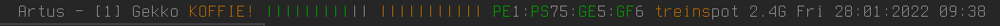

# Dface :: An I3 status bar

## Modules
- mpd
- caffeine
- http status code checker
- battery
- volume
- maildir watch
- network
- datetime

## Usage

    # make a copy of the standard config file
    cp config.h.def config.h

    # build
    make
